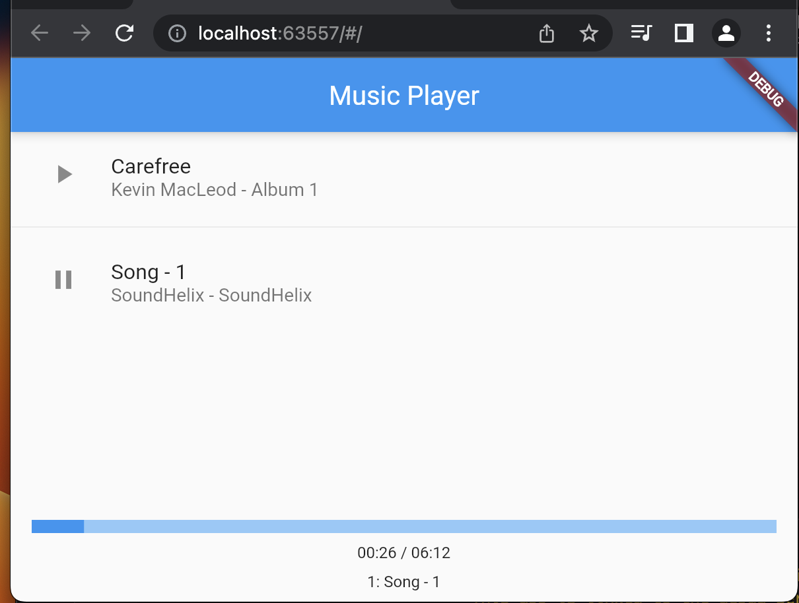
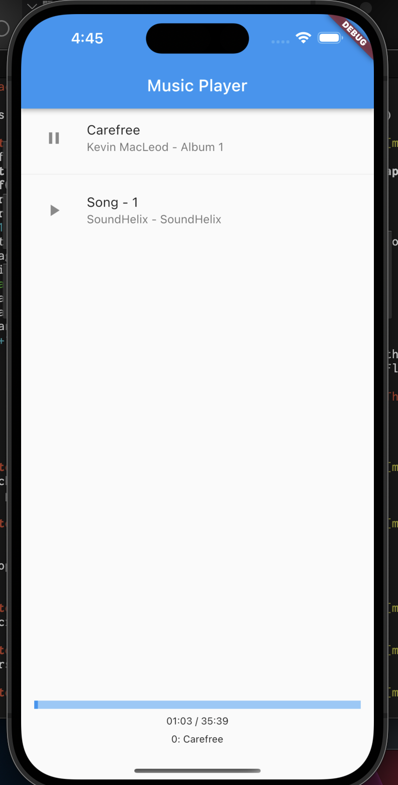

# music_sample

A new Flutter project.

## プロンプト

```text
flutter 3.6 でミュージックプレーヤーアプリのサンプルアプリを作成してください。
(https://github.com/suragch/streaming_audio_flutter_demo/tree/master/lib のコードを参考にしてください)

再生の一時停止、再生の再開も実装してください。
曲の途中で一時停止してから再生をする場合、停止位置から再生をする様にしてください。
just_audio: のライブラリーを利用してください。
曲の属性には、title, artist album, 音ファイルのURL, 画像ファイルの URL, 再生開始位置 を含めてくだい。
play 状態と pause 受胎がわかるようにボタンの形を変化させてください。
プレイリストの曲数が多い場合はスクロールできる様にしてください。
プレーリストの各局の頭に再生開始・停止ボタンをつけてください。
プログレスバーに再生位置を表示してください。再生位置は逐次 更新してください。
ファイル構成は次のようにしてください。
必要なら、他のファイルやフォルダを追加してください。

music_player_app/
  ├── android/
  ├── ios/
  ├── lib/
  │   ├── models/
  │   │   ├── audio_file.dart
  │   ├── providers/
  │   │   ├── audio_provider.dart
  │   ├── screens/
  │   │   ├── music_player_screen.dart
  │   ├── widgets/
  │   │   ├── audio_list_tile.dart
  │   │   ├── player_controls.dart
  │   ├── main.dart
  ├── test/
  ├── pubspec.yaml
  └── README.md

```

最初にファイル構成を示してください。
ファイルのコードブロック毎に回答を分割して示してください。
"次を表示" と言ったら、次の回答を示してください。
ファイルに内容は省略せずに表示してください。すべてのメソッドは必ず実装してください。
```

## スクリーンショット

- chreom

- ios



## See
- https://github.com/suragch/audio_playlist_flutter_demo/blob/master/final/lib/page_manager.dart
  playlist_flutter_demo
